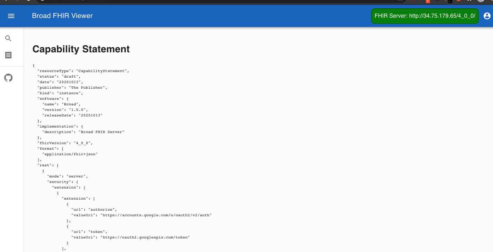

# 🔥 Broad FHIR

<p align="center">
  <a href="https://github.com/DataBiosphere/FHIR/workflows/FHIR%20-%20Tests/badge.svg" alt="FHIR - Tests">
    </a>
  <a href="https://github.com/DataBiosphere/FHIR/workflows/TCGA%20-%20Tests/badge.svg" alt="TCGA - Tests">
    </a>
  <a href="https://github.com/DataBiosphere/FHIR/workflows/ANVIL%20-%20Tests/badge.svg" alt="ANVIL - Tests">
    </a>
  <a href="https://github.com/DataBiosphere/FHIR/workflows/ANVIL%20-%20Tests/badge.svg" alt="Viewer - Tests">
    </a>
</p>

> FHIR is an interoperability standard intended to facilitate the exchange of healthcare information between healthcare providers, patients, caregivers, payers, researchers, and any one else involved in the healthcare ecosystem. It consists of 2 main parts – a content model in the form of ‘resources’, and a specification for the exchange of these resources in the form of real-time RESTful interfaces as well as messaging and Documents.

## Getting started

Clone.

```
git clone https://github.com/DataBiosphere/FHIR
```

Install. You must run these separately in these directories: `anvil-api`, `fhir`, `tcga`, `viewer`

```
npm i
```

Run the tests.

```
npm run test
```

Configure your projects. This project uses [dotenv](https://github.com/motdotla/dotenv) extensively to make configuration easy. See [Configuration](./docs/CONFIGURATION.md)

```
touch .env
touch fhir/.env
touch tcga/.env
touch viewer/.env
```

Run Docker Compose.

```
docker-compose up
```

## SMART App

Broad FHIR comes with it's own [SMART on FHIR](http://www.hl7.org/fhir/smart-app-launch/) application. You can run it locally or host it statically.

```
cd viewer
npm i
npm start
```



## Documentation

Read our docs pages for information on deployment, tech stack, design decisions, and more.

[Docs](./docs/INDEX.md)

## Auth endpoints

### Authorize

https://accounts.google.com/o/oauth2/v2/auth

### Token

https://oauth2.googleapis.com/token
